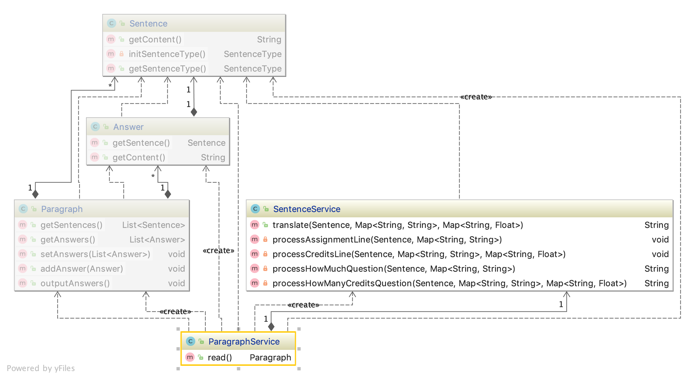

merchant-to-galaxy
========================

## 设计思路
### 结构图

* jdk1.8
* 罗马符号组合的规则用正则表达式表示
* 程序输入为完整的一段话即Paragraph, 每一行为sentence, 恢复的内容为answer
* sentence 的类型有：assigned、credit、how many、how much
* 罗马字符的计算是从后往前算，如果后面的大于前面的就用大减小，否则就是相加

## 使用说明
运行Main.main(), 从test-data.txt里拷贝一段测试输入，整段粘到标准输入，两次回车（一个空白行表示结束）
> todo： 直接从文件读取输入